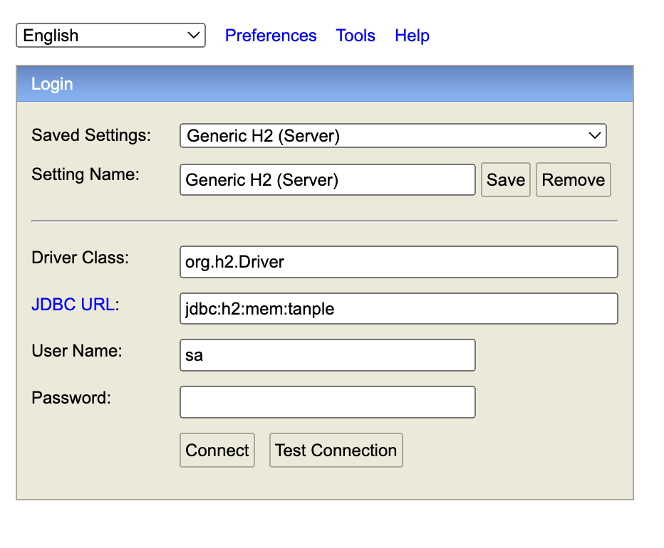

<div align="center">
  <br>
<p align="center" width="100%">
    
</p>
  <h2>탄소저감 크레딧 플랫폼, 탄플 - 백엔드</h2></hr>
  <p align="center">
    
    
    
    
    
</div>
</div>


## pre-requisite

1. install jdk-17
```bash
# install jdk-17
```

2. clone repository
```bash
git clone https://github.com/inha-tanple/tanple-backend.git
cd tanple-backend
```

## run

1. run h2-database

```bash
cd h2/bin

# Windows
./h2.bat

# macOS
./h2.sh
```

> you can access database in web 

2. run server
