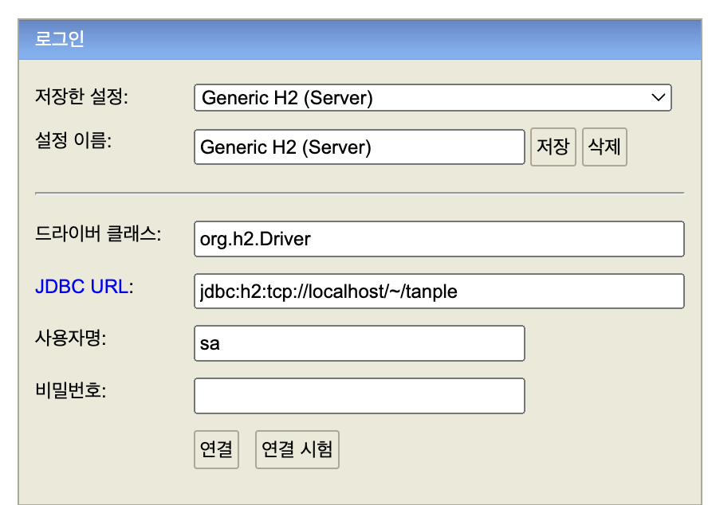

# tanple-backend
tanple backend
hello World

## pre-requisite


## how to setup h2 database
1. run script 
```
# Windows
./h2/bin/h2.bat

# macOS
sh ./h2/bin/h2.sh
```

2. open in web and fill below


